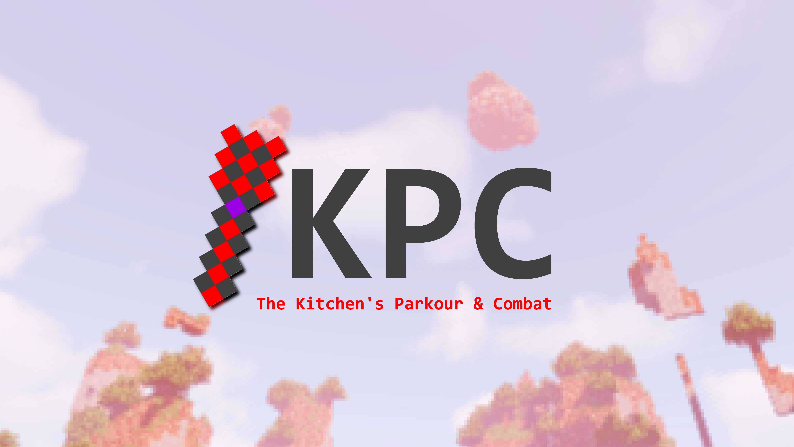
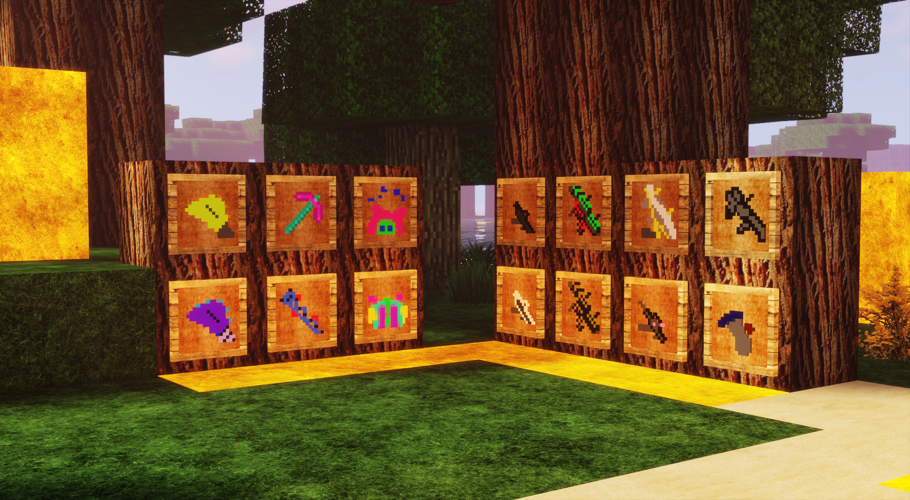

# 

## What is KPC?

#### About KPC

At its core, __KPC adds parkour and combat items to the game that enhance PvP and PvE. __ However, it does much more than that... __each game version has its own unique features__ that you can read about below.

#### 1.7.10

__KPC__ was first made for 1.7.10.  It features the original parkour gripper and an arsenal of PvP weapons.  It also adds gravitational anomalies to the overworld.

See __releases/1.7.10__ & __builds/1.7.10/release 1.0/__ to find the mod for this version of Minecraft.

Support for this version of Minecraft has been __discontinued.__

#### 1.12

In 1.12, __KPC__ adds more ways to move in Minecraft by adding the Parkour Gripper.  This small, sword-like tool type changes the way the player moves by adding mechanics such as leaping and wall-running.  The mod also adds a few new structures to the game and promises powerful loot in the form of Tokens of Valor, Ruby gear, Night Shade items, Dichotomic materials, Higgs artifacts and more.  In doing so, the mod adds an arsenal of combat weapons to widen the PvP & PvE experience.

See the __builds/1.12.2/server test releases for KPC 3.1__ folder & look for __releases 3.1.4 to 3.1.9.__  Note that __3.1.8 & 3.1.9__ may have __strange terrain generation.__

Support for this version of Minecraft has been __discontinued.__

#### 1.15

__KPC__ for Minecraft 1.15 aims to make the items found in the popular 1.12 version feel like vanilla items.  Many of the items have been redesigned to have __custom sounds, animations, etc,__ and a lot of the __balancing has been reworked.__

See __builds/1.15.2/__ to download the mod.  Note that items in the development folder are not meant to be balanced and are just __proof-of-concept.__

This version of Minecraft is in the __development stage.. expect bugs.__

## Installation

This mod is __made for specific versions of Minecraft!__  It will not run on unsupported versions of the game.  To install the mod, simply put the mod jar file in your Minecraft mods folder ([How to install a Minecraft mod](https://minecraft.gamepedia.com/Mods/Installing_Forge_mods)).

## Versions

KPC currently runs on three different versions pf Minecraft: __1.7.10, 1.12.2, 1.15.2.__  1.15.2 is the only supported versions at this time.  __More versions will be listed when they are become supported.__

## Contributing
Feel free to fork and make something awesome!  The __mod sources__ for 1.12 can be found in the __server test releases for KPC 3.1__ folder.  1.15 source files will be added as development progresses.  If you would like to add support for other versions of Minecraft, be sure to let me know via [email](mailto:dupontinquiries@gmail.com).

## Discord Server

A Discord server is coming soon.  It will aid the testing and development that goes into KPC.

## Screenshots

#### KPC for Minecraft 1.7.10

#### KPC for Minecraft 1.12.2

#### KPC for Minecraft 1.15.2

Coming soon!

